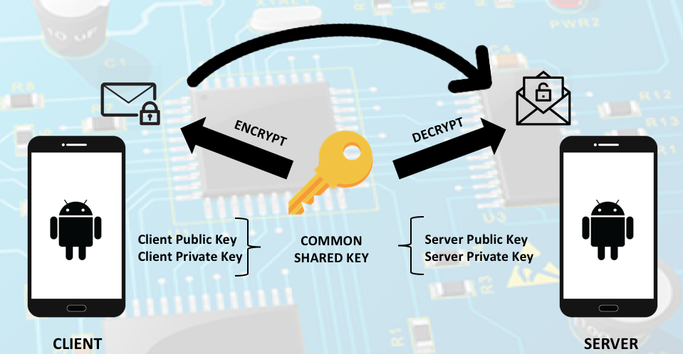

# ECC

ECC is a project implementing the Elliptic Curve Cryptography standard for the Diffie-Hellman keys exchange, in order to establish a secure channel between two Android devices.

# How does it work?
## Architecture

The architecture is conceptually divided into two parts:
* Client 
* Server

At the beginning, both parties generate their own pair of keys (private and public) and, once they have shared the public one, a common shared key is built.
Then, the client starts the communication by sending any message, that is automatically encrypted with the common pre-shared key. On the server side, the messages are received, decrypted through the same shared key and displayed on the screen as original.

## Implementation
The connection, at software level, is implemented through sockets and threads, one for each part, which allow the communication between the client and server. Obviously, both the parties need to be connected to the same LAN, otherwise the protocol can't establish a correct connection.

# Goal of this project
The Goal of this project is to realise a message exchange system able to take into account the advantages of the Elliptic Curve cryptography system, which can be a great replacement of the well known RSA, especially in the IoT area.

# Contact
Linkedin:
 * [Jacopo Maria Valtorta](https://www.linkedin.com/in/jacopo-maria-valtorta)

# Check out the project presentation
SlideShare: 
  * [ECC Message Exchange](https://www.slideshare.net/JacopoMariaValtorta/elliptic-curve-cryptography-message-exchange)
